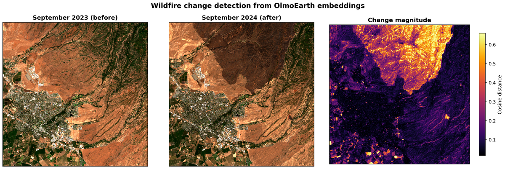

# Change Detection

Wildfire burn scar detection using per-pixel cosine distance between
monthly OlmoEarth embeddings. Compares September 2023 (before) and
September 2024 (after) over the Park Fire region in Butte County,
California. Using the same month one year apart eliminates seasonal
artifacts.

## Usage

```bash
# 1. Compute embeddings and download imagery for both periods
python -m change_detection.compute --config config.json

# 2. Analyze and generate figure
python -m change_detection.analyze \
    --before-dir data/change_detection/sept_2023 \
    --after-dir data/change_detection/sept_2024 \
    --out figures/
```

## Expected output

**Change detection** (`figures/change_detection.png`)

Left: Sentinel-2 RGB, September 2023. Center: Sentinel-2 RGB, September
2024. Right: cosine distance heatmap (bright = high change).


