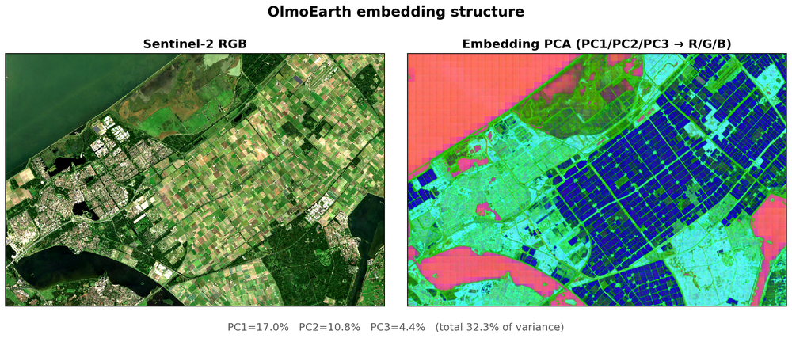

# PCA False-Color Visualization

Unsupervised visualization of OlmoEarth embeddings over Flevoland,
Netherlands. Maps the first three principal components to R/G/B channels,
producing a false-color image where pixels with similar embeddings receive
similar colors.

## Usage

```bash
# 1. Compute embeddings and download imagery
python -m pca.compute --config config.json

# 2. Analyze and generate figure
python -m pca.analyze \
    --embed data/flevoland/embeddings.tif \
    --rgb data/flevoland/s2_rgb.tif \
    --out figures/
```

## Expected output

**PCA false-color** (`figures/pca_false_color.png`)

Left: Sentinel-2 RGB. Right: PCA false-color from the first three principal
components of the embedding vectors.


