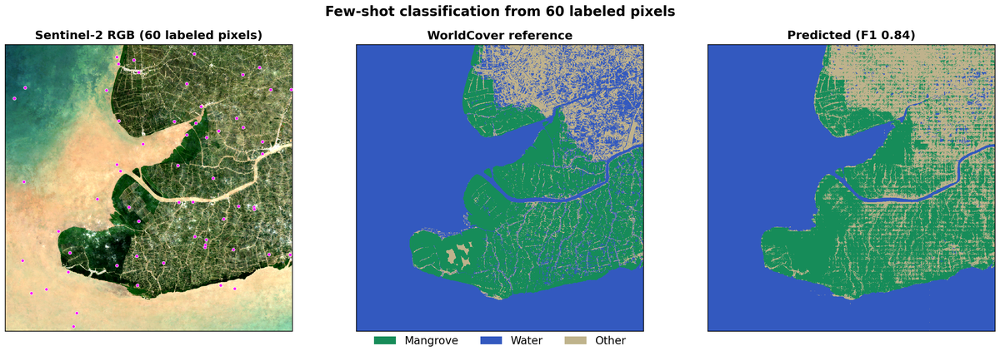

# Few-Shot Segmentation

Few-shot land-cover classification over Ca Mau, Vietnam using OlmoEarth
embeddings. Samples 60 labeled pixels (20 per class) from ESA WorldCover,
trains a logistic regression, and predicts every pixel in the region.

Three classes: mangrove, water, other.

## Usage

```bash
# 1. Compute embeddings and download imagery + WorldCover
python -m segmentation.compute --config config.json

# 2. Analyze and generate figure
python -m segmentation.analyze \
    --data-dir data/segmentation/ca_mau \
    --out figures/
```

## Expected output

**Few-shot classification** (`figures/fewshot_60labels.png`)

Left: Sentinel-2 RGB with 60 labeled pixels (magenta dots). Center:
WorldCover reference. Right: predicted classification (weighted F1 ~ 0.84;
exact score depends on which pixels are sampled).


