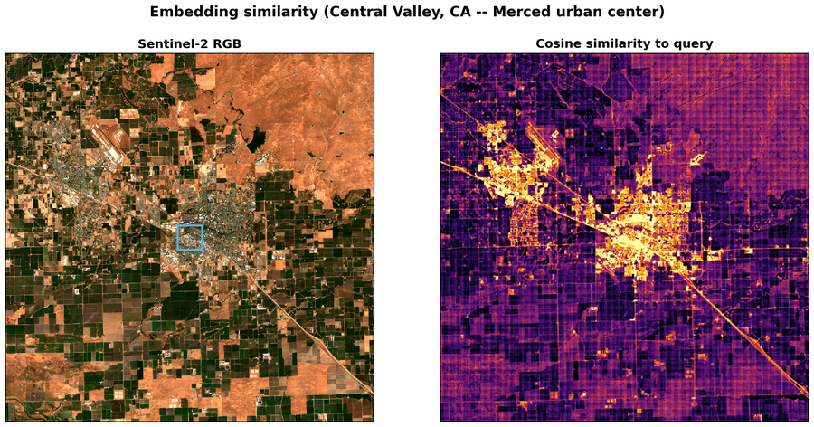
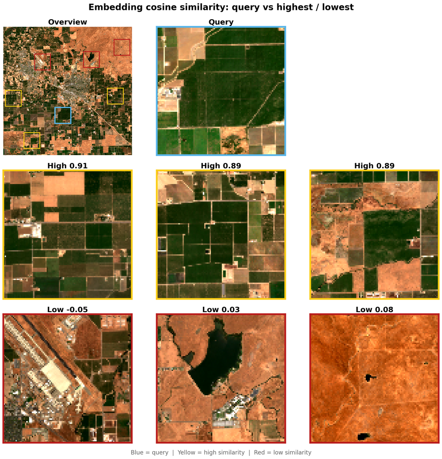

# Similarity Search

Cosine-similarity analysis over California's Central Valley using OlmoEarth
embeddings. Picks a query pixel, computes per-pixel cosine similarity against
the full embedding raster, and generates two figures:

1. A **similarity heatmap** overlaid on Sentinel-2 imagery.
2. A **patch mosaic** showing the most and least similar locations.

## Usage

```bash
# 1. Compute embeddings and download imagery
python -m similarity.compute --config config.json

# 2. Analyze and generate figures
python -m similarity.analyze \
    --embed data/central_valley/embeddings.tif \
    --rgb data/central_valley/s2_rgb.tif \
    --out figures/
```

## Expected output

**Similarity heatmap** (`figures/similarity_heatmap.png`)



**Patch mosaic** (`figures/similarity_mosaic.png`)


